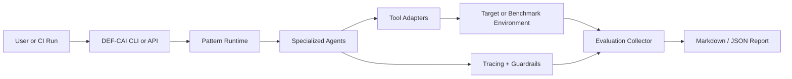

# DEF-CAI — Pipeline Map

## Paper Identity Correction
- Scaffold docs currently cite `2503.16012`, but that arXiv ID resolves to an unrelated gaze-tracking paper.
- The CAI framework paper used by the reference repo and this PRD suite is `2504.06017`.
- All mappings below are grounded on `papers/2504.06017_CAI-An-Open-Bug-Bounty-Ready-Cybersecurity-AI.pdf` and `repositories/cai/`.

## Component Mapping
| Paper Component | Paper Reference | Reference Repo Signal | DEF-CAI Build Target |
|---|---|---|---|
| Autonomy taxonomy | Table 1, §1.1 | Docs + paper only | `docs/autonomy_levels.md`, evaluation notes, acceptance tests |
| Core architecture pillars: Agents, Tools, Handoffs, Patterns, Turns, HITL | Fig. 3, §2 | `repositories/cai/docs/cai_architecture.md` | `src/anima_def_cai/core/`, `src/anima_def_cai/agents/`, `src/anima_def_cai/patterns/`, `src/anima_def_cai/runtime/` |
| Specialized agent patterns: Red Team, Bug Bounty, Blue Team | Fig. 5, §2 | `repositories/cai/src/cai/agents/*.py`, `.../patterns/*.py` | `src/anima_def_cai/agents/` and `src/anima_def_cai/patterns/` |
| Tool layer: linux command, code execution, web search, SSH, Shodan, traffic capture | Fig. 5, §2 | `repositories/cai/src/cai/tools/` | `src/anima_def_cai/tools/` with typed adapters + safety policy |
| Prompt-injection / dangerous command guardrails | §2, repo docs | `repositories/cai/src/cai/agents/guardrails.py` | `src/anima_def_cai/safety/guardrails.py`, policy config, tests |
| CLI + HITL via interrupt | §2 | `repositories/cai/src/cai/cli.py` and docs | `src/anima_def_cai/cli.py`, `src/anima_def_cai/runtime/session.py` |
| Benchmark controller and datasets | §3.1-§3.2, Tables 2-4 | `repositories/cai/benchmarks/eval.py`, `benchmarks/utils/*` | `src/anima_def_cai/eval/`, `configs/eval/*.toml`, `tests/test_eval_*` |
| Robotics security workflows (MiR, ROS, MQTT, HTB robotics) | Fig. 2, Table 2, §4 | Paper + repo case-study signals | `src/anima_def_cai/ros2/`, `src/anima_def_cai/connectors/robot_targets.py` |
| Bug bounty validation flow | §3.5, Tables 7-8 | `bug_bounter.py`, `retester.py` | Bug bounty agent + report generation + retest workflow |
| Tracing / observability | Fig. 3, §2 | `repositories/cai/src/cai/sdk/agents/tracing/` | `src/anima_def_cai/telemetry/` |

## ANIMA Build Phases
| Phase | Goal | Outputs |
|---|---|---|
| Phase 1 | Normalize scaffold and build runtime foundation | `anima_def_cai` package, settings, schemas, CLI shell |
| Phase 2 | Recreate CAI orchestration primitives | agents, patterns, handoffs, tool contracts, HITL runtime |
| Phase 3 | Recreate benchmark and validation loops | CAIBench-compatible eval runner, report generation, baseline metrics |
| Phase 4 | Add robotics-facing integration | ROS2 inspectors, robot target adapters, robotics benchmark fixtures |
| Phase 5 | Harden for production | guardrails, tracing, Docker/API, release artifacts |

## Intended Source Layout
```text
src/anima_def_cai/
├── __init__.py
├── cli.py
├── settings.py
├── schemas/
├── core/
├── runtime/
├── agents/
├── patterns/
├── tools/
├── safety/
├── telemetry/
├── eval/
├── reports/
└── ros2/
```

## Benchmark / Validation Flow


## Gaps To Track
| Gap | Why It Matters | Planned Handling |
|---|---|---|
| Current scaffold still uses `anima_daikokuten` paths | Breaks module identity and future implementation tasks | First foundation task renames package and config namespace |
| Wrong local PDF / wrong arXiv ID in scaffold | Would produce invalid PRDs | Corrected in `ASSETS.md`, `PRD.md`, and PRDs |
| Reference repo is broader than paper scope | Risk of overbuilding | PRDs prioritize paper figures, benchmark flows, and core agents only |
| Private competition / bug bounty assets are not bundled | Exact paper reproduction is not fully possible | Reproduce open subsets and document deltas in evaluation PRD |
